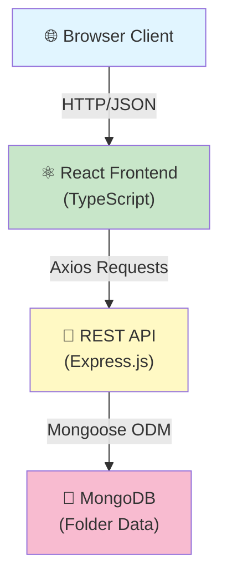
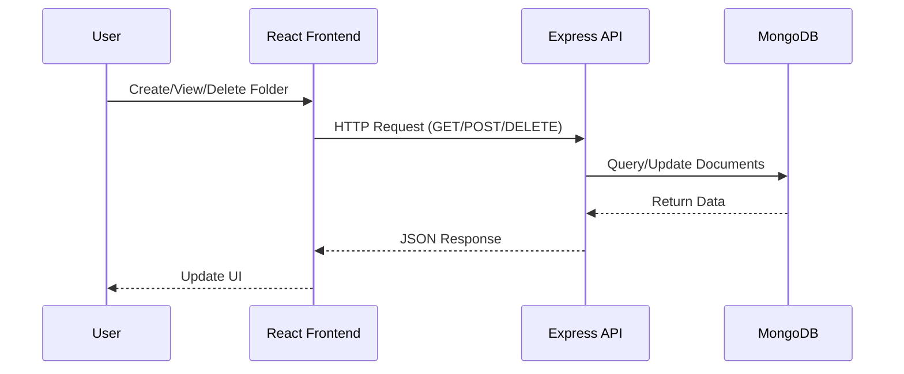
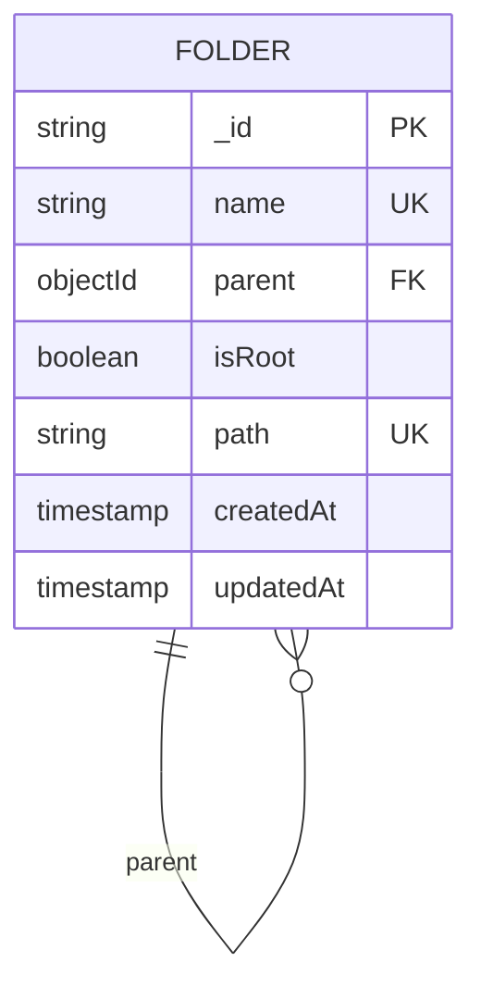
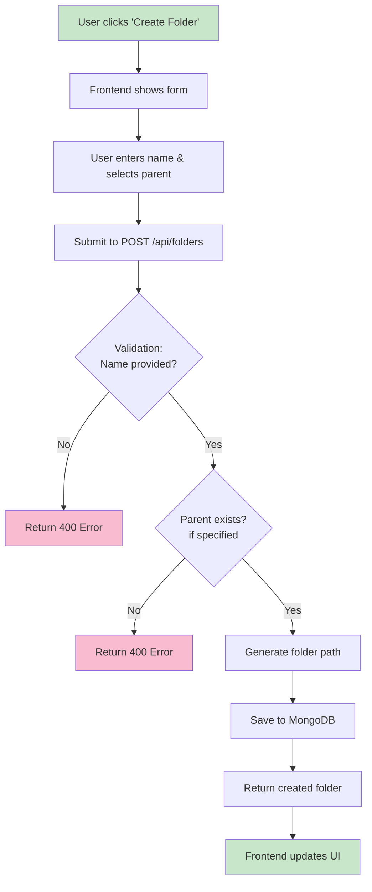
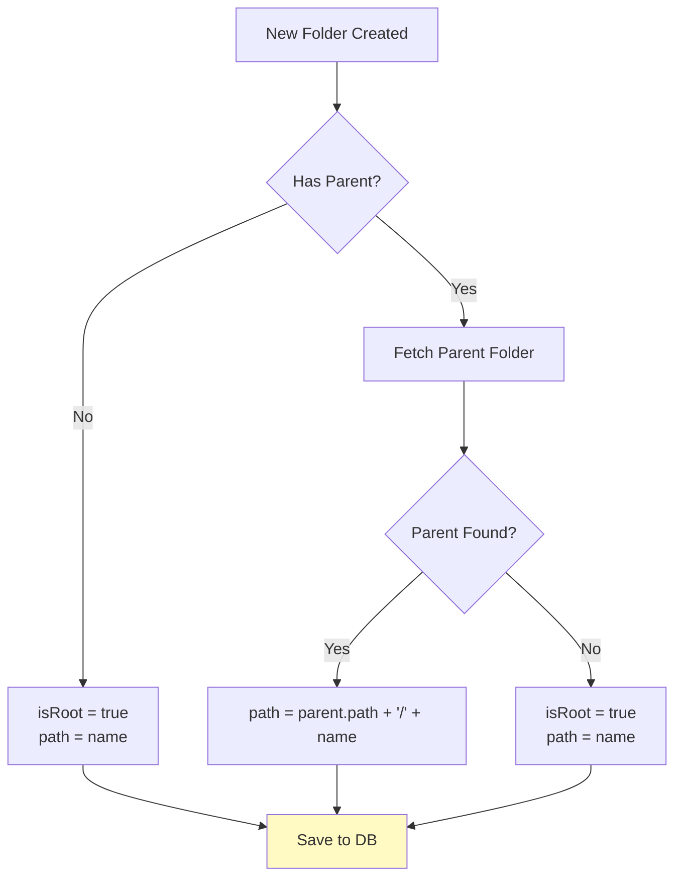
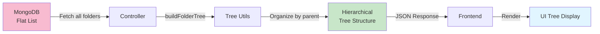

# Folder Structure Viewer 📁

A full-stack web application for managing and visualizing hierarchical folder structures. Built with **Express.js**, **MongoDB**, and **React**, this project allows users to create, view, and manage nested folder hierarchies with an intuitive tree-based interface.

---

## 📋 Table of Contents

1. [Project Overview](#project-overview)
2. [Architecture](#architecture)
3. [Technology Stack](#technology-stack)
4. [Project Structure](#project-structure)
5. [Getting Started](#getting-started)
6. [API Documentation](#api-documentation)
7. [Features](#features)
8. [Data Model](#data-model)
9. [Workflows](#workflows)

---

## 🎯 Project Overview

The **Folder Structure Viewer** is a modern web application that enables users to:
- Create and manage unlimited nested folder hierarchies
- View folder structures in both flat and hierarchical tree formats
- Perform CRUD operations on folders
- Maintain parent-child relationships with automatic path generation
- Organize content with persistent MongoDB storage

**Perfect for:** File management systems, content organization platforms, knowledge bases, and hierarchical data visualization applications.

---

## 🏗️ Architecture

### System Architecture Diagram



### Request/Response Flow



---

## 💻 Technology Stack

| Layer | Technology | Version |
|-------|-----------|---------|
| **Frontend** | React | ^18.3.1 |
| **Frontend Language** | TypeScript | ^4.9.5 |
| **Frontend Styling** | Styled-components | ^6.1.19 |
| **Backend** | Express.js | ^4.18.2 |
| **Backend Language** | TypeScript | ^5.9.2 |
| **Database** | MongoDB | Latest |
| **ODM** | Mongoose | ^8.18.0 |
| **HTTP Client** | Axios | ^1.11.0 |
| **CORS** | CORS Middleware | ^2.8.5 |

---

## 📂 Project Structure

```
folder-structure/
│
├── backend/                          # Express.js Server
│   ├── src/
│   │   ├── index.ts                 # Server entry point
│   │   ├── models/
│   │   │   └── Folder.ts            # MongoDB schema & model
│   │   ├── controllers/
│   │   │   └── folderController.ts  # Business logic
│   │   ├── routes/
│   │   │   └── folderRoutes.ts      # API endpoints
│   │   ├── types/
│   │   │   └── index.ts             # TypeScript interfaces
│   │   └── utils/
│   │       └── treeUtils.ts         # Tree building utilities
│   ├── package.json
│   └── tsconfig.json
│
├── frontend/                         # React Application
│   ├── src/
│   │   ├── index.tsx                # React entry point
│   │   ├── App.tsx                  # Main App component
│   │   ├── components/
│   │   │   ├── Folder.tsx           # Folder UI component
│   │   │   └── FolderStructure.tsx  # Main structure component
│   │   ├── services/
│   │   │   └── api.ts               # API client
│   │   ├── styles/
│   │   │   └── App.css              # Styling
│   │   └── types/
│   │       └── index.ts             # TypeScript interfaces
│   ├── public/
│   │   └── index.html               # HTML template
│   ├── package.json
│   └── tsconfig.json
│
└── README.md                         # This file
```

### Directory Purposes

| Directory | Purpose |
|-----------|---------|
| `backend/src/models/` | MongoDB schemas and data models |
| `backend/src/controllers/` | Request handlers and business logic |
| `backend/src/routes/` | API route definitions |
| `backend/src/utils/` | Helper functions (tree building, etc.) |
| `frontend/components/` | React UI components |
| `frontend/services/` | API communication layer |

---

## 🚀 Getting Started

### Prerequisites

- **Node.js** 16.x or higher
- **npm** or **yarn**
- **MongoDB** running locally or a connection URL
- **Git** (optional)

### Installation

#### 1. Clone or Extract Project

```bash
cd folder-structure
```

#### 2. Backend Setup

```bash
cd backend

# Install dependencies
npm install

# Create .env file
echo "PORT=5000" > .env
echo "MONGODB_URI=mongodb://localhost:27017/folder-structure" >> .env

# Start development server
npm run dev

# Or build and run production
npm run build
npm start
```

#### 3. Frontend Setup (in a new terminal)

```bash
cd frontend

# Install dependencies
npm install

# Start development server
npm start
```

The frontend will open at `http://localhost:3000` and backend API runs on `http://localhost:5000`.

### Environment Variables

**Backend (.env)**

```
PORT=5000
MONGODB_URI=mongodb://localhost:27017/folder-structure
NODE_ENV=development
```

---

## 📡 API Documentation

### Base URL
```
http://localhost:5000/api
```

### Endpoints

#### 1. Get All Folders (Flat List)

```
GET /api/folders
```

**Response:**
```json
[
  {
    "_id": "507f1f77bcf86cd799439011",
    "name": "Documents",
    "parent": null,
    "isRoot": true,
    "path": "Documents",
    "createdAt": "2024-01-15T10:30:00Z",
    "updatedAt": "2024-01-15T10:30:00Z"
  },
  {
    "_id": "507f1f77bcf86cd799439012",
    "name": "Work",
    "parent": "507f1f77bcf86cd799439011",
    "isRoot": false,
    "path": "Documents/Work",
    "createdAt": "2024-01-15T10:31:00Z",
    "updatedAt": "2024-01-15T10:31:00Z"
  }
]
```

#### 2. Get Folder Tree (Hierarchical)

```
GET /api/folders/tree
```

**Response:**
```json
[
  {
    "_id": "507f1f77bcf86cd799439011",
    "name": "Documents",
    "children": [
      {
        "_id": "507f1f77bcf86cd799439012",
        "name": "Work",
        "children": []
      }
    ]
  }
]
```

#### 3. Create Folder

```
POST /api/folders
Content-Type: application/json

{
  "name": "Projects",
  "parentId": "507f1f77bcf86cd799439011"
}
```

**Parameters:**
- `name` (string, required): Folder name
- `parentId` (string, optional): Parent folder ID. Omit to create root folder

**Response:** Created folder object (201 Created)

#### 4. Delete Folder

```
DELETE /api/folders/:id
```

**Parameters:**
- `id` (string): Folder ID to delete

**Response:** Success message (200 OK)

#### 5. Health Check

```
GET /api/health
```

**Response:**
```json
{
  "message": "Server is running"
}
```

---

## ✨ Features

### Current Features

- ✅ **Create Folders**: Add new root and nested folders
- ✅ **View Hierarchy**: Display folder structures in tree format
- ✅ **Delete Folders**: Remove folders and their children
- ✅ **Automatic Paths**: System generates folder paths automatically
- ✅ **Parent-Child Relationships**: Maintain hierarchical structure in MongoDB
- ✅ **TypeScript Support**: Full type safety across frontend and backend
- ✅ **REST API**: Complete CRUD operations via REST endpoints
- ✅ **CORS Enabled**: Allow cross-origin requests
- ✅ **Error Handling**: Comprehensive error handling and validation

### Future Enhancement Possibilities

- 📝 Rename folders
- 📋 Batch operations
- 🔍 Search and filter functionality
- 👥 User authentication and permissions
- 📤 Import/export folder structures
- 🔄 Move folders between parents
- 📊 Folder analytics and statistics

---

## 🗄️ Data Model

### Folder Schema



### Folder Document Example

```json
{
  "_id": ObjectId("507f1f77bcf86cd799439011"),
  "name": "Documents",
  "parent": null,
  "isRoot": true,
  "path": "Documents",
  "createdAt": ISODate("2024-01-15T10:30:00Z"),
  "updatedAt": ISODate("2024-01-15T10:30:00Z")
}
```

### Key Fields

| Field | Type | Description |
|-------|------|-------------|
| `_id` | ObjectId | Unique identifier |
| `name` | String | Folder name (required, trimmed) |
| `parent` | ObjectId | Reference to parent folder (null for root) |
| `isRoot` | Boolean | Flag indicating if folder is at root level |
| `path` | String | Full path (e.g., "Documents/Work/Projects") |
| `createdAt` | Timestamp | Creation timestamp |
| `updatedAt` | Timestamp | Last update timestamp |

### Indexes

```javascript
// Performance indexes
FolderSchema.index({ parent: 1 });      // Fast parent lookups
FolderSchema.index({ path: 1 });        // Fast path queries
```

---

## 🔄 Workflows

### Folder Creation Workflow



### Folder Path Generation Logic



### Tree Building Process



---

## 🔧 Development Commands

### Backend

```bash
# Development mode with auto-reload
npm run dev

# Build TypeScript to JavaScript
npm run build

# Production mode
npm start
```

### Frontend

```bash
# Start development server
npm start

# Build for production
npm run build

# Run tests
npm test

# Eject configuration (⚠️ irreversible)
npm run eject
```

---

## 🐛 Debugging

### Common Issues

**1. MongoDB Connection Error**
- Ensure MongoDB is running: `mongod`
- Verify MONGODB_URI in .env file
- Check firewall/network settings

**2. CORS Errors**
- Ensure backend CORS middleware is enabled
- Verify frontend URL is not blocked
- Check browser console for specific errors

**3. Port Already in Use**
- Change PORT in .env (default: 5000)
- Or kill existing process using the port

### Logs

- Backend logs: Console output in terminal running `npm run dev`
- Frontend logs: Browser Console (F12)
- MongoDB logs: MongoDB console/logs

---

## 📦 Building for Production

### Backend

```bash
cd backend
npm run build
# Creates dist/ folder with compiled JavaScript
npm start  # Runs from dist/index.js
```

### Frontend

```bash
cd frontend
npm run build
# Creates build/ folder ready for deployment
# Deploy build/ folder to static hosting (Vercel, Netlify, AWS S3, etc.)
```

---

## 📝 Code Examples

### Creating a Folder via API

```bash
curl -X POST http://localhost:5000/api/folders \
  -H "Content-Type: application/json" \
  -d '{
    "name": "My Projects",
    "parentId": null
  }'
```

### React Component Usage

```typescript
import { useEffect, useState } from 'react';
import axios from 'axios';

function FolderManager() {
  const [folders, setFolders] = useState([]);

  useEffect(() => {
    // Fetch folder tree
    axios.get('http://localhost:5000/api/folders/tree')
      .then(res => setFolders(res.data))
      .catch(err => console.error(err));
  }, []);

  return (
    <div>
      {folders.map(folder => (
        <div key={folder._id}>{folder.name}</div>
      ))}
    </div>
  );
}
```

---

## 📚 TypeScript Interfaces

### IFolder

```typescript
interface IFolder {
  _id?: string;
  name: string;
  parent: string | null;
  isRoot: boolean;
  path: string;
  createdAt?: Date;
  updatedAt?: Date;
}
```

### CreateFolderRequest

```typescript
interface CreateFolderRequest {
  name: string;
  parentId?: string;
}
```

### FolderResponse

```typescript
interface FolderResponse {
  _id: string;
  name: string;
  parent: string | null;
  isRoot: boolean;
  path: string;
  createdAt: string;
  updatedAt: string;
}
```

---

## 🤝 Contributing

1. Create a feature branch: `git checkout -b feature/new-feature`
2. Commit changes: `git commit -m 'Add new feature'`
3. Push to branch: `git push origin feature/new-feature`
4. Open a Pull Request

---

## 📄 License

ISC License - Feel free to use this project!

---

## 📞 Support

For issues, questions, or suggestions, please:
1. Check the troubleshooting section
2. Review API documentation
3. Check browser console and backend logs
4. Open an issue on the repository

---

**Happy Folder Managing! 📁✨**
